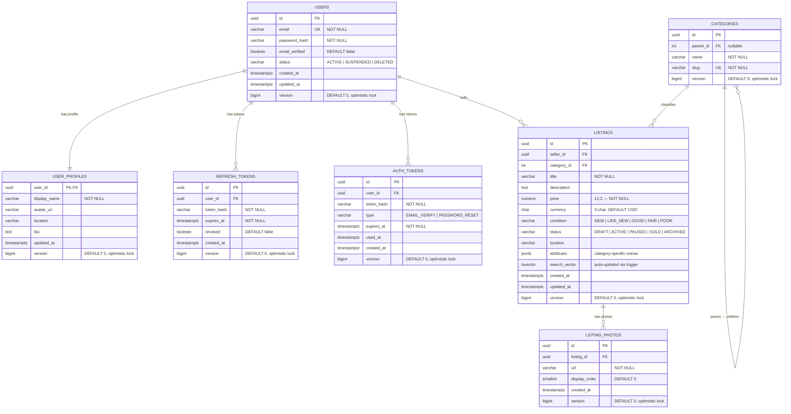

# App Service — Database Schema

> **Service:** App Service (users + listings)
>
> **Database:** PostgreSQL (see [ADR-002](adr/ADR-002-database.md))
>
> **Migrations:** Flyway

---

## ER Diagram

---

## Tables

### `users`

Core identity record. Credentials only — profile data lives in `user_profiles`.

| Column           | Type           | Notes                                |
|------------------|----------------|--------------------------------------|
| `id`             | `uuid`         | PK, `gen_random_uuid()`              |
| `email`          | `varchar(255)` | Unique, lowercased                   |
| `password_hash`  | `varchar`      | bcrypt                               |
| `email_verified` | `boolean`      | Default `false`                      |
| `status`         | `varchar`      | `ACTIVE` \| `SUSPENDED` \| `DELETED` |
| `created_at`     | `timestamptz`  |                                      |
| `updated_at`     | `timestamptz`  |                                      |
| `version`        | `bigint`       | Default `0`, optimistic lock         |

---

### `user_profiles`

One-to-one with `users`. Separated to keep auth queries lean.

| Column         | Type           | Notes                        |
|----------------|----------------|------------------------------|
| `user_id`      | `uuid`         | PK, FK → `users`             |
| `display_name` | `varchar(100)` | NOT NULL                     |
| `avatar_url`   | `varchar(500)` | Object storage URL           |
| `location`     | `varchar(200)` | Free text for now            |
| `bio`          | `text`         |                              |
| `updated_at`   | `timestamptz`  |                              |
| `version`      | `bigint`       | Default `0`, optimistic lock |

---

### `refresh_tokens`

Stores hashed refresh tokens for JWT auth.

| Column       | Type          | Notes                        |
|--------------|---------------|------------------------------|
| `id`         | `uuid`        | PK                           |
| `user_id`    | `uuid`        | FK → `users`                 |
| `token_hash` | `varchar`     | SHA-256 of raw token         |
| `expires_at` | `timestamptz` |                              |
| `revoked`    | `boolean`     | Default `false`              |
| `created_at` | `timestamptz` |                              |
| `version`    | `bigint`      | Default `0`, optimistic lock |

Index on `(user_id, revoked)`.

---

### `auth_tokens`

Single-use tokens for email verification and password reset.

| Column       | Type          | Notes                              |
|--------------|---------------|------------------------------------|
| `id`         | `uuid`        | PK                                 |
| `user_id`    | `uuid`        | FK → `users`                       |
| `token_hash` | `varchar`     | SHA-256 of raw token               |
| `type`       | `varchar`     | `EMAIL_VERIFY` \| `PASSWORD_RESET` |
| `expires_at` | `timestamptz` |                                    |
| `used_at`    | `timestamptz` | Null until consumed                |
| `created_at` | `timestamptz` |                                    |
| `version`    | `bigint`      | Default `0`, optimistic lock       |

---

### `categories`

Admin-managed, self-referencing category tree.

| Column      | Type           | Notes                        |
|-------------|----------------|------------------------------|
| `id`        | `uuid`         | PK                           |
| `parent_id` | `int`          | FK → `categories`, nullable  |
| `name`      | `varchar(100)` | NOT NULL                     |
| `slug`      | `varchar(100)` | Unique                       |
| `version`   | `bigint`       | Default `0`, optimistic lock |

---

### `listings`

Central listing record. `attributes` (JSONB) holds category-specific fields (e.g. size, color, ISBN) without an EAV
schema.

| Column          | Type            | Notes                                               |
|-----------------|-----------------|-----------------------------------------------------|
| `id`            | `uuid`          | PK                                                  |
| `seller_id`     | `uuid`          | FK → `users`                                        |
| `category_id`   | `int`           | FK → `categories`                                   |
| `title`         | `varchar(200)`  | NOT NULL                                            |
| `description`   | `text`          |                                                     |
| `price`         | `numeric(12,2)` | NOT NULL                                            |
| `currency`      | `char(3)`       | ISO 4217, default `USD`                             |
| `condition`     | `varchar`       | `NEW` \| `LIKE_NEW` \| `GOOD` \| `FAIR` \| `POOR`   |
| `status`        | `varchar`       | `DRAFT` → `ACTIVE` → `PAUSED` → `SOLD` / `ARCHIVED` |
| `location`      | `varchar(200)`  |                                                     |
| `attributes`    | `jsonb`         | Category-specific extras                            |
| `search_vector` | `tsvector`      | Auto-updated via trigger on `title` + `description` |
| `created_at`    | `timestamptz`   |                                                     |
| `updated_at`    | `timestamptz`   |                                                     |
| `version`       | `bigint`        | Default `0`, optimistic lock                        |

Key indexes: GIN on `search_vector`, GIN on `attributes`, btree on `(seller_id, status)`, btree on
`(category_id, status)`.

---

### `listing_photos`

Ordered photos per listing. Actual files live in object storage; this table holds URLs only.

| Column          | Type           | Notes                        |
|-----------------|----------------|------------------------------|
| `id`            | `uuid`         | PK                           |
| `listing_id`    | `uuid`         | FK → `listings`              |
| `url`           | `varchar(500)` | NOT NULL                     |
| `display_order` | `smallint`     | 0-based, default `0`         |
| `created_at`    | `timestamptz`  |                              |
| `version`       | `bigint`       | Default `0`, optimistic lock |

---

## Notes

- All timestamps are `timestamptz` (stored in UTC).
- UUIDs are generated with `gen_random_uuid()` (PostgreSQL built-in).
- Enum-like columns use `varchar` with a check constraint — avoids painful Postgres enum migrations.
- `search_vector` is maintained by a `BEFORE INSERT OR UPDATE` trigger; no application-side FTS wiring needed.
- Schema migrations are managed with Flyway (`V1__init.sql`, etc.).
